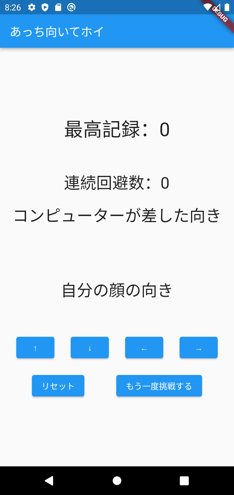
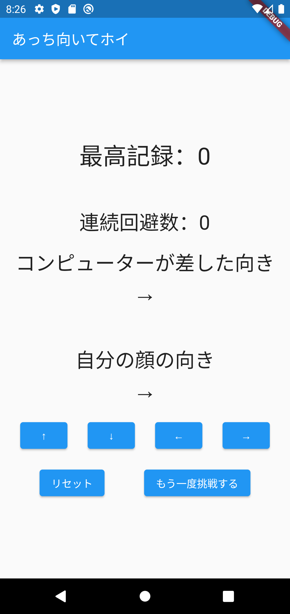

# flutter_finger_pointing

## Flutterの教科書 実践課題

### 第７章 変数・関数・条件分岐の基礎『じゃんけん』

B. あっち向いてホイを作ろう
↑↓←→ をコンピューターがランダムで出力し、それと一致した方向を選択してしまうと負けとなる「あっち向いてホイ」ゲームを作ってみましょう。連続何回回避できているかを画面上に表示し、スコアを競えるような仕組みもつけてみましょう。

### ◆機能の説明

1. コンピューターが差した向き（ランダム）と 自分の顔の向き（ユーザーが選択した向き）が異なる時、 回避成功として連続回避数が１増える。

2. 向きが同じの時、回避失敗となる。 
   その時点で向きの選択ができなくなり、 その時点での連続回避数と最高記録を比較して、 連続回避数が最高記録を超えた場合、最高記録が更新される。

3. 「リセット」ボタンを押すと最高記録のデータも含めて0にできる

4. 「もう一度挑戦する」ボタンを押すと最高記録のデータは残したまま、 連続回避数が0になって、向きの選択ができるようになる。

### ◆上記の課題の完成図

スタート画面

あっち向いてホイが終了して記録が更新

リセットボタンを押した時

